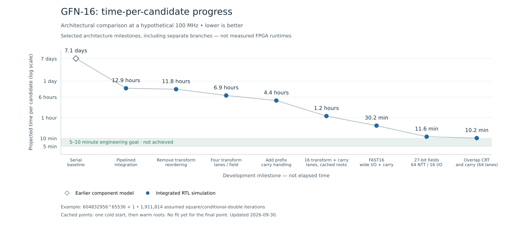

# GFN-16 FPGA progress

Progress toward an FPGA implementation of GFN-16 modular arithmetic, with the
longer-term aspiration of throughput comparable to a low-end GPU from the same era.
This repository publishes the **progress chart, sanitized milestone data and plotting code**,
not the full RTL project or vendor tool outputs.

## Current state — 2026-09-30 UTC

- **Fit-backed planning:** FAST16 projects about **37.7 minutes/candidate at an
  assumed 80 MHz**, below its reported 82.28 MHz whole-core Fmax. It missed its 100 MHz
  fit target; there is no separate 80 MHz closure run or board measurement.
- **Best simulated cycle count:** a separate64-lane streaming branch takes
  **32,116 warm cycles**, projecting **10.2 minutes at hypothetical 100 MHz**.
  This branch has **no completed physical fit**. Do not treat it as 10-minute
  demonstrated throughput.
- **Current integration:** a new 27-bit streaming-precision core passed its
  16-lane full-size arithmetic test at 90,521 warm cycles versus 94,686 for its
  baseline, about 4.4% fewer cycles. Wider/fault validation and fitting remain.
- No board has been tested and no complete PrimeGrid-compatible PRP/proof
  worker has been benchmarked or submitted work.



## What the chart means

Every point uses a **hypothetical common 100 MHz clock** to compare architectures:

```text
projected seconds = cycles per square × 1,911,814 / 100,000,000
```

For cached-root milestones, the estimate instead uses one cold start and warm
iterations thereafter:

```text
projected seconds = (cold-start cycles + warm cycles × 1,911,813) / 100,000,000
```

The latest plotted milestone uses 32,116 warm cycles (294,268 cold), giving
about **10.2 minutes at hypothetical 100 MHz**. It has not been physically
timing-qualified. Cache resets/errors would add root-loading work. The chart
selects architectural milestones across separate experimental branches; it is
not a claim that every point is a successive release of one combined core.

The example candidate is `604832956^65536 + 1`. This approximates one modular
square/conditional-double per exponent bit. The clock is **not a verified operating
frequency**, and the plotted times are **not FPGA measurements or full PRP benchmarks**.

The first point is the earlier serial component-cycle model. Later points are
complete modular-square RTL simulations, including conversion, root loading,
three field engines, CRT reconstruction, carry handling and controller overhead.
Five consecutive full-size random squares reused the preceding RTL output at each
integrated milestone. Additional corner cases and deliberate fault-injection tests
were run, but five samples are not a full-PRP average or universal worst-case bound.

Proof generation/verification, checkpoints and board/host overhead are excluded.
The 5–10 minute band is a chosen engineering goal, **not demonstrated GPU parity**.
The x-axis shows milestone order, not elapsed development time.

## Physical evidence and current bottleneck

The original full-width 64-lane core failed device capacity: 44,147 LABs required
versus 42,720 available. The narrower 27-bit 64-lane core reached placement using
42,538 LABs (99.6%), but routing remains in progress. **Placement is not a
completed fit or a timing result.** About 73% of its raw placed ALMs are in the
three NTT engines, making routing simplification a priority.

Selected completed **standalone component** fits on the provisional Arria10
target, using Quartus Pro 26.1:

| Component | Reported Fmax | Raw DSP blocks | Qualification |
| --- | ---: | ---: | --- |
| Retimed 27-bit CRT | 133.87 MHz | 10 | Misses 200 MHz target |
| Pair-step 27-bit CRT | 214.73 MHz | 10 | Meets 200 MHz; adds 32 latency clocks, still one result/cycle |
| Precision carry, 16 lanes | 150.74 MHz | 275 | Meets 150 MHz; not yet physically verified in new core |
| Generated-root NTT64, field 2 | 104.08 MHz | 128 | Meets 100 MHz; memory-saving architecture has setup overhead |

Component Fmax is **not** whole-core Fmax. Raw DSP counts above are distinct
from Quartus's packing-adjusted “DSP blocks needed” figures. All fits use
virtual I/O and a provisional device identity; they are not board sign-off.
Sanitized report identifiers and numbers are in [experiments.json](experiments.json).

## FPGA-specific optimization work

| Experiment | State at this update |
| --- | --- |
| Stream CRT into precision carry | Separate 27-bit core implemented; 16-lane full-size normals pass; wider/fault gates pending |
| Fold NTT routing into address generation | Component 64-lane gate passes; separate whole-core integration testing |
| Prefetch generated-root seeds | Full16 all-field gate passes: 78,340 vs 79,771 arithmetic clocks; full64 gate pending |
| Local radix-4/adjacent-stage fusion | Planned next algorithm/schedule experiment |
| Forward final NTT output directly into CRT | Planned; needs width conversion, ordering and backpressure proof |
| Candidate interleaving and lane balancing | Planned; evaluate equal-device-budget aggregate throughput |
| More regular streaming/hybrid NTT | Planned resource/schedule study, not an adopted architecture |
| Lazy modular reduction | Planned bounded experiment; [0,2P) needs 28 bits for all current primes, potentially losing 27-bit DSP mapping |

Changes are integrated one at a time, tested against a frozen baseline, then
physically fitted. A component win earns an integration trial—not automatic
promotion. The goal is completed candidates per second, not maximum MHz or
maximum lane count independently.

## Reproduce the chart

Requires Python 3.10 or newer:

```sh
python3 -m venv .venv
. .venv/bin/activate
python -m pip install -r requirements.txt
python plot_progress.py
python -m unittest discover -s tests
```

This regenerates `progress.svg` and `progress.png` from `progress.json`. It does
**not** reproduce the underlying hardware-design simulations. The data includes
hashes identifying private regression evidence and RTL snapshots; those hashes
are provenance identifiers, not a substitute for publicly inspectable test outputs.

## Update policy

Append an integrated milestone only after its full-size RTL output passes an
independent whole-integer oracle. Keep its cycle count, source hash, date, evidence
class and qualifications. Component-only experiments and unimplemented ideas do
not become integrated progress points. Regenerate both images after changing data.

When measured hardware data becomes available, add it as a separate evidence
class rather than relabelling these projections as measurements. Preserve historical
milestones; document corrections explicitly.

No credentials, machine addresses, tool licenses, installers, raw vendor reports,
or unrelated workspace material are included here. Publication does not imply
PrimeGrid endorsement or an operational PrimeGrid-compatible worker.
